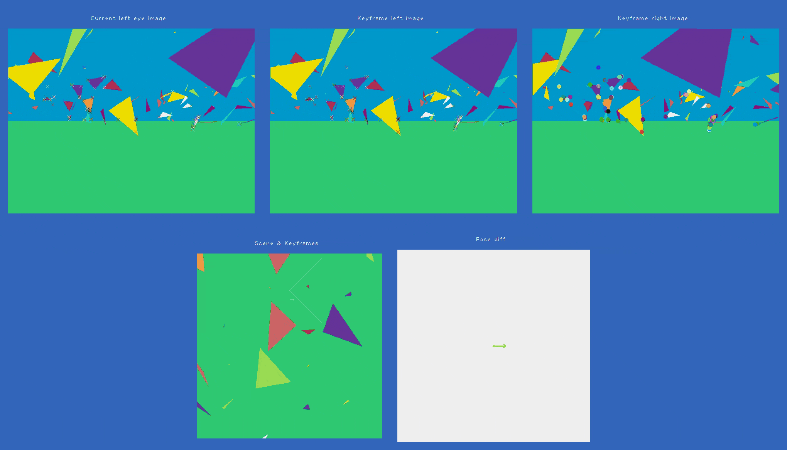
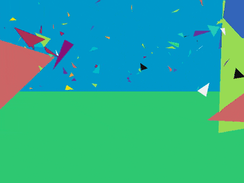
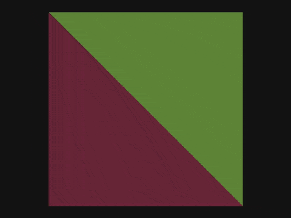
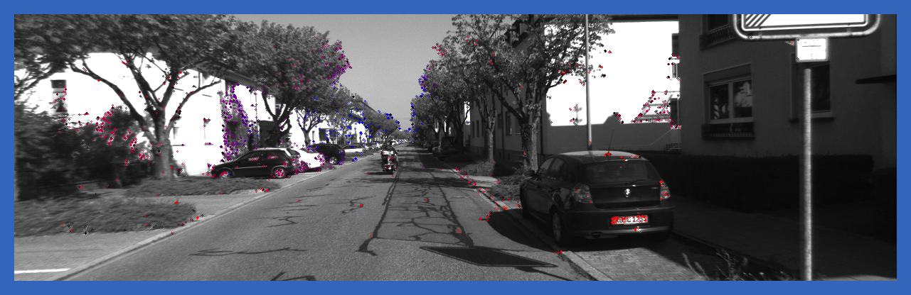

VSLAM
=====

Intro
-----

This repo contains an easy-to-understand Visual Simultaneous Localization And Mapping (VSLAM) algorithm, as well
as easy-to-understand triangle-based scene rendering implementation, which is used to provide simulated
data for the VSLAM algorithm


The VSLAM part of this repo is largely reinterpretation of tutorials presented in an ***excellent*** book 
*"Introduction to Visual SLAM: From Theory to Practice"*. See the associated
[github repo](https://github.com/gaoxiang12/slambook) provided by the authors of the book.
They also generously [provided pdf of the book itself in a realted repo](https://github.com/gaoxiang12/slambook-en/blob/master/slambook-en.pdf).
This is very awesome and I am grateful for that.


Here is how it works currently on an imagined scene.



As you can see, there is probably a bug around turns, but generally it works.

Installing
----------

I tend to use virtualenvs with minimal wrapping in `pipenv`.

```
pipenv --python 3.10
pipenv shell
pip install -r requirements.txt
```


To briefly summarize, we depend mostly on `attrs`, `numpy`, `jax` (!), `opencv-python`, `pandas` and `scipy`.
`jax` is not critical and could be done away with in favour of numpy, but it keeps things fast.


Exploring
----------

Run `python -m sim.render` to see the current status of the rendering code.
Experiment with WSAD, QE and arrow keys. Looks more or less like this:



With less funky cube scene



You can also check out the VSLAM framework pieces that I am building one-by-one.
These examples, generally, require downloading data from the Kitti dataset.

- `python ex_01_extract_and_match_features.py` shows details of basic keypoint / feature detection matching
It looks like this: 
  
- `python ex_02_one_frame_binocular_depth_est.py` shows binocular depth estimation.
  It looks like this: 
  The more blue the keypoint color, the deeper it is. The more red it is, the nearer the the camera.
    
